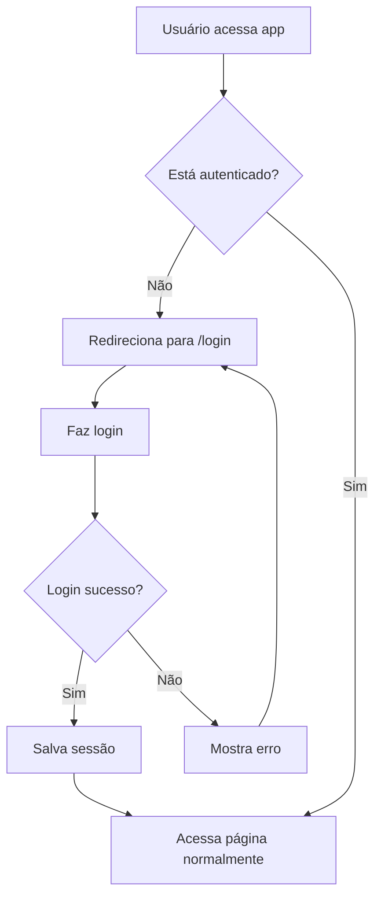

# 🔐 Sistema de Autenticação

## ✅ Funcionalidades Implementadas

### 🎯 Autenticação Completa

- **Login**: Email e senha com validação
- **Registro**: Criar nova conta com confirmação por email
- **Logout**: Sair do sistema de forma segura
- **Recuperação de Senha**: Reset via email
- **Perfil do Usuário**: Visualizar e editar informações
- **Alterar Senha**: Atualizar senha dentro do sistema

### 🛡️ Segurança

- **Middleware de Autenticação**: Protege rotas automaticamente
- **Sessão Persistente**: Usuário permanece logado entre sessões
- **Supabase Auth**: Autenticação gerenciada pelo Supabase
- **Tokens Seguros**: JWT tokens com renovação automática
- **Password Reset**: Link seguro com expiração

## 📁 Estrutura de Arquivos

```
e:\Apps\appOS\
├── composables/
│   └── useAuth.ts              ✅ Hook de autenticação
├── middleware/
│   └── auth.ts                 ✅ Middleware de proteção
├── pages/
│   ├── login.vue               ✅ Página de login/registro
│   ├── perfil.vue              ✅ Perfil do usuário
│   └── reset-password.vue      ✅ Reset de senha
├── components/
│   └── AppNavigation.vue       ✅ Com botão de logout
└── app.vue                     ✅ Inicializa autenticação
```

## 🚀 Como Usar

### 1. Configurar Supabase

Certifique-se de que as variáveis de ambiente estão configuradas:

```env
SUPABASE_URL=sua_url_do_supabase
SUPABASE_KEY=sua_chave_publica
```

### 2. Criar Usuários no Supabase

**Opção A: Via Dashboard**

1. Acesse o Dashboard do Supabase
2. Vá para Authentication → Users
3. Clique em "Add user"
4. Preencha email e senha
5. Marque "Auto Confirm User" (opcional)

**Opção B: Via Aplicação**

1. Acesse http://localhost:3000/login
2. Clique em "Criar conta"
3. Preencha os dados
4. Confirme via email (se confirmação estiver ativada)

### 3. Fazer Login

1. Acesse http://localhost:3000/login
2. Digite email e senha
3. Clique em "Entrar"
4. Será redirecionado para a página principal

### 4. Proteger Rotas

Para proteger uma página, adicione o middleware:

```vue
<script setup lang="ts">
definePageMeta({
  middleware: "auth",
});
</script>
```

## 🔧 Composable useAuth

### Propriedades

```typescript
const {
  user, // Usuário autenticado (ref)
  session, // Sessão atual (ref)
  loading, // Estado de carregamento (ref)
  isAuthenticated, // Booleano se está autenticado (computed)
  initAuth, // Inicializar autenticação
  signIn, // Fazer login
  signUp, // Criar conta
  signOut, // Fazer logout
  resetPassword, // Resetar senha
  updatePassword, // Atualizar senha
} = useAuth();
```

### Exemplos de Uso

#### Login

```typescript
const { signIn, loading } = useAuth();

const handleLogin = async () => {
  const result = await signIn("email@exemplo.com", "senha123");

  if (result.success) {
    navigateTo("/");
  } else {
    console.error(result.error);
  }
};
```

#### Registro

```typescript
const { signUp } = useAuth();

const handleRegister = async () => {
  const result = await signUp(
    "email@exemplo.com",
    "senha123",
    { name: "João Silva" } // Metadata opcional
  );

  if (result.success) {
    console.log(result.message);
  }
};
```

#### Logout

```typescript
const { signOut } = useAuth();

const handleLogout = async () => {
  await signOut();
  // Automaticamente redireciona para /login
};
```

#### Resetar Senha

```typescript
const { resetPassword } = useAuth();

const handleReset = async () => {
  const result = await resetPassword("email@exemplo.com");

  if (result.success) {
    console.log(result.message);
  }
};
```

#### Alterar Senha

```typescript
const { updatePassword } = useAuth();

const handleChange = async () => {
  const result = await updatePassword("novaSenha123");

  if (result.success) {
    console.log("Senha atualizada!");
  }
};
```

## 🛣️ Rotas

### Públicas (sem autenticação)

- `/login` - Login e registro
- `/reset-password` - Reset de senha

### Protegidas (requer autenticação)

- `/` - Página inicial (redireciona para /gerenciar)
- `/gerenciar` - Lista de ordens de serviço
- `/nova` - Nova ordem de serviço
- `/estatisticas` - Estatísticas
- `/perfil` - Perfil do usuário
- `/visualizar/[id]` - Visualizar OS

## 🔐 Middleware de Autenticação

O middleware `auth.ts` faz automaticamente:

1. **Verifica autenticação**: Checa se usuário está logado
2. **Inicializa sessão**: Se ainda não foi inicializada
3. **Redireciona**:
   - Para `/login` se não estiver autenticado
   - Para `/` se já estiver logado e tentar acessar `/login`

## 📊 Fluxo de Autenticação



## 🎨 Interface de Login

### Recursos da UI

- **Dark Mode**: Suporte completo a tema escuro
- **Validação**: Campos obrigatórios e validação de email
- **Feedback Visual**: Mensagens de erro e sucesso
- **Toggle Senha**: Mostrar/ocultar senha
- **Responsivo**: Mobile-first design
- **Loading States**: Indicadores de carregamento
- **Modo Registro**: Alternar entre login e criar conta

### Componentes Visuais

- ✅ Logo da empresa
- ✅ Background gradiente animado
- ✅ Cards com glassmorphism
- ✅ Ícones SVG inline
- ✅ Animações de transição
- ✅ Estados de hover/focus

## 📱 Perfil do Usuário

### Informações Exibidas

- Email do usuário
- ID único
- Data de criação da conta
- Formulário de alteração de senha

### Segurança do Perfil

- Validação de senha (mínimo 6 caracteres)
- Confirmação de senha
- Feedback em tempo real
- Proteção por middleware

## 🔄 Reset de Senha

### Fluxo Completo

1. **Solicitar Reset**:

   - Usuário clica em "Esqueceu a senha?"
   - Digite email
   - Recebe link por email

2. **Email Enviado**:

   - Supabase envia email automático
   - Link expira em 1 hora (configurável)

3. **Nova Senha**:

   - Usuário clica no link
   - Acessa `/reset-password`
   - Define nova senha

4. **Confirmação**:
   - Senha atualizada
   - Redireciona para login

## ⚙️ Configurações do Supabase

### Habilitar Confirmação de Email (Opcional)

1. Dashboard Supabase → Authentication → Settings
2. Desmarque "Enable email confirmations"
3. Ou configure SMTP para envio de emails

### Personalizar Email Templates

1. Authentication → Email Templates
2. Customize:
   - Confirm signup
   - Reset password
   - Magic Link

### Configurar Redirect URL

```typescript
const { error } = await supabase.auth.resetPasswordForEmail(email, {
  redirectTo: `${window.location.origin}/reset-password`,
});
```

## 🐛 Troubleshooting

### Usuário não consegue fazer login

**Verificar:**

- [ ] Email e senha corretos
- [ ] Usuário foi criado no Supabase
- [ ] Confirmação de email (se ativada)
- [ ] Variáveis de ambiente configuradas
- [ ] Console do navegador para erros

### Redirect loop infinito

**Solução:**

- Limpar localStorage
- Verificar middleware nas páginas
- Conferir se `initAuth()` está sendo chamado

### Session não persiste

**Verificar:**

- [ ] Cookies habilitados no navegador
- [ ] Supabase URL/Key corretos
- [ ] localStorage acessível
- [ ] CORS configurado

### Email de reset não chega

**Verificar:**

- [ ] SMTP configurado no Supabase
- [ ] Spam/lixo eletrônico
- [ ] Email template ativo
- [ ] Rate limiting não atingido

## 🎯 Boas Práticas

### Segurança

✅ **Fazer:**

- Sempre usar middleware `auth` em rotas protegidas
- Validar dados no frontend E backend
- Usar HTTPS em produção
- Configurar rate limiting
- Implementar 2FA (futuro)

❌ **Evitar:**

- Armazenar senhas em plain text
- Confiar apenas em validação frontend
- Ignorar erros de autenticação
- Reutilizar tokens expirados

### Performance

✅ **Fazer:**

- Cachear dados do usuário
- Lazy load páginas protegidas
- Verificar sessão apenas uma vez no init
- Usar computed properties

❌ **Evitar:**

- Múltiplas chamadas de `initAuth()`
- Buscar usuário em cada componente
- Navegações desnecessárias

## 📈 Próximas Melhorias

- [ ] **OAuth Social**: Google, GitHub
- [ ] **2FA**: Autenticação de dois fatores
- [ ] **Roles & Permissions**: Sistema de permissões
- [ ] **Session Timeout**: Logout automático
- [ ] **Login History**: Histórico de acessos
- [ ] **Magic Links**: Login sem senha
- [ ] **Biometria**: Face ID / Touch ID (PWA)

## 📞 Suporte

Problemas? Verifique:

- [Documentação Supabase Auth](https://supabase.com/docs/guides/auth)
- [Nuxt Middleware](https://nuxt.com/docs/guide/directory-structure/middleware)
- Console do navegador (F12)
- Network tab para ver requisições

## 🎓 Recursos de Aprendizado

- [Supabase Auth Quickstart](https://supabase.com/docs/guides/auth/quickstarts)
- [Nuxt 3 Authentication](https://nuxt.com/docs/getting-started/authentication)
- [JWT Best Practices](https://auth0.com/blog/a-look-at-the-latest-draft-for-jwt-bcp/)
